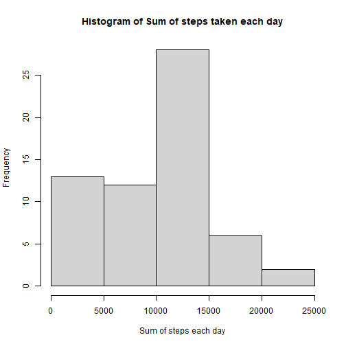
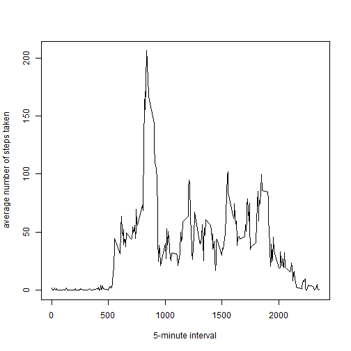
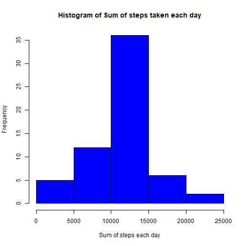
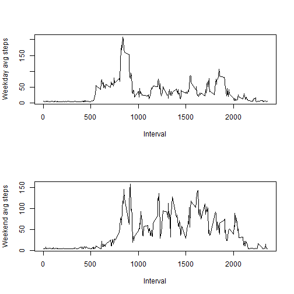

Read the file and transform

```r
mydata <- read.csv("activity.csv", na.strings = "NA")
#change the class of the date column to Date type
mydata$date <- as.Date(mydata$date, "%Y-%m-%d")
```

## Section 1: What is mean total number of steps taken per day?
### Total number of steps taken per day

```r
steps_day <- data.frame(sum=tapply(mydata$steps, mydata$date, sum, na.rm = TRUE))
steps_day
```

```
##              sum
## 2012-10-01     0
## 2012-10-02   126
## 2012-10-03 11352
## 2012-10-04 12116
## 2012-10-05 13294
## 2012-10-06 15420
## 2012-10-07 11015
## 2012-10-08     0
## 2012-10-09 12811
## 2012-10-10  9900
## 2012-10-11 10304
## 2012-10-12 17382
## 2012-10-13 12426
## 2012-10-14 15098
## 2012-10-15 10139
## 2012-10-16 15084
## 2012-10-17 13452
## 2012-10-18 10056
## 2012-10-19 11829
## 2012-10-20 10395
## 2012-10-21  8821
## 2012-10-22 13460
## 2012-10-23  8918
## 2012-10-24  8355
## 2012-10-25  2492
## 2012-10-26  6778
## 2012-10-27 10119
## 2012-10-28 11458
## 2012-10-29  5018
## 2012-10-30  9819
## 2012-10-31 15414
## 2012-11-01     0
## 2012-11-02 10600
## 2012-11-03 10571
## 2012-11-04     0
## 2012-11-05 10439
## 2012-11-06  8334
## 2012-11-07 12883
## 2012-11-08  3219
## 2012-11-09     0
## 2012-11-10     0
## 2012-11-11 12608
## 2012-11-12 10765
## 2012-11-13  7336
## 2012-11-14     0
## 2012-11-15    41
## 2012-11-16  5441
## 2012-11-17 14339
## 2012-11-18 15110
## 2012-11-19  8841
## 2012-11-20  4472
## 2012-11-21 12787
## 2012-11-22 20427
## 2012-11-23 21194
## 2012-11-24 14478
## 2012-11-25 11834
## 2012-11-26 11162
## 2012-11-27 13646
## 2012-11-28 10183
## 2012-11-29  7047
## 2012-11-30     0
```

### Mean of total number of steps taken per day

```r
mean(steps_day$sum)
```

```
## [1] 9354.23
```

### Median of total number of steps taken per day

```r
median(steps_day$sum)
```

```
## [1] 10395
```

### Histogram of the total number of steps taken each day

```r
hist(steps_day$sum, xlab = "Sum of steps each day", main = "Histogram of Sum of steps taken each day")
```




## Section 2: What is the average daily activity pattern?

### time series plot of the 5-minute interval (x-axis) and the average number of steps taken, averaged across all days (y-axis)

```r
#create another variable which has avg steps according to the interval
avg_steps_interval <- tapply(mydata$steps, mydata$interval, mean, na.rm = TRUE)


plot(avg_steps_interval~unique(mydata$interval), type = "l", xlab = "5-minute interval", ylab = "average number of steps taken")
```



### Time interval containing max number of steps

```
##     avg_steps_interval  V2
## 835           206.1698 835
```


## Section 3: Imputing missing values


### Counting the total rows with NAs

```r
sum(is.na(mydata))
```

```
## [1] 2304
```

### Taking the mean of all the steps and using that value in the place of NAs

```r
mydata2 <- mydata
mydata2$steps[is.na(mydata2$steps)] <- mean(mydata$steps, na.rm = TRUE)

head(mydata2)
```

```
##     steps       date interval
## 1 37.3826 2012-10-01        0
## 2 37.3826 2012-10-01        5
## 3 37.3826 2012-10-01       10
## 4 37.3826 2012-10-01       15
## 5 37.3826 2012-10-01       20
## 6 37.3826 2012-10-01       25
```

### Histogram of the total number of steps taken each day

```r
steps_day2 <- data.frame(sum = tapply(mydata2$steps, mydata2$date, sum))

hist(steps_day2$sum, col = "blue", xlab = "Sum of steps each day", main = "Histogram of Sum of steps taken each day")
```



### Mean of total number of steps taken per day

```r
mean(steps_day2$sum)
```

```
## [1] 10766.19
```

### Median of total number of steps taken per day

```r
median(steps_day2$sum)
```

```
## [1] 10766.19
```


## Section 4: Are there differences in activity patterns between weekdays and weekends?

### Creating a new factor variable in the dataset with two levels – “weekday” and “weekend”

```r
mydata2 <- mydata2 %>% mutate(Day = factor(weekdays(mydata2$date)))

#As the levels are the 7 days of the week, have to make them to weekday and weekend
levels(mydata2$Day)[1] 
```

```
## [1] "Friday"
```

```r
levels(mydata2$Day)[1] <- "Weekday"
levels(mydata2$Day)[1]
```

```
## [1] "Weekday"
```

```r
levels(mydata2$Day)[2]
```

```
## [1] "Monday"
```

```r
levels(mydata2$Day)[2] <- "Weekday"
levels(mydata2$Day)[2]
```

```
## [1] "Saturday"
```

```r
levels(mydata2$Day)[2] <- "Weekend"
levels(mydata2$Day)[2]
```

```
## [1] "Weekend"
```

```r
levels(mydata2$Day)[3]
```

```
## [1] "Sunday"
```

```r
levels(mydata2$Day)[3] <- "Weekend"
levels(mydata2$Day)[3] 
```

```
## [1] "Thursday"
```

```r
levels(mydata2$Day)[3] <- "Weekday"
levels(mydata2$Day)[3] 
```

```
## [1] "Tuesday"
```

```r
levels(mydata2$Day)[3] <- "Weekday"
levels(mydata2$Day)[3]
```

```
## [1] "Wednesday"
```

```r
levels(mydata2$Day)[3] <- "Weekday"
levels(mydata2$Day) 
```

```
## [1] "Weekday" "Weekend"
```


### Panel plot of 5 min interval vs avg number of steps taken, averaged across all weekday days or weekend days

```r
#filter out weekdays and weekends separately
weekday_steps <- mydata2 %>% filter(Day == "Weekday")
weekend_steps <- mydata2 %>% filter(Day == "Weekend")

#take averages for weekday and weekend steps using tapply()
weekday_mean <- tapply(weekday_steps$steps, weekday_steps$interval, mean)
weekend_mean <- tapply(weekend_steps$steps, weekend_steps$interval, mean)

#start to plot
par(mfrow = c(2,1))
plot(unique(mydata2$interval),weekday_mean, type = "l", xlab = "Interval", ylab = "Weekday avg steps")
plot(unique(mydata2$interval),weekend_mean, type = "l", xlab = "Interval", ylab = "Weekend avg steps")
```



